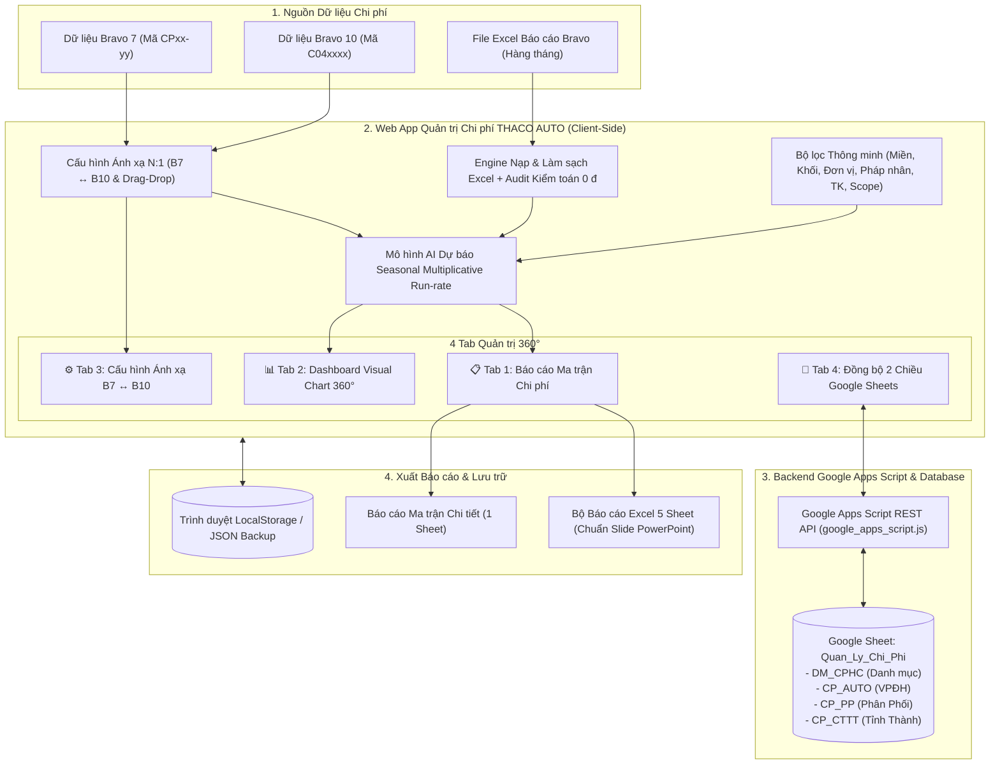

# HỆ THỐNG QUẢN TRỊ CHI PHÍ HÀNH CHÍNH - THACO AUTO
**Giải pháp Quản trị Chi phí Bravo 7 ↔ Bravo 10 | Mô hình AI Dự báo Cuốn chiếu (Rolling Forecast) | Đồng bộ 2 chiều Google Sheets**

---

## 🌟 1. Giới thiệu Tổng quan & Giá trị Quản trị

Hệ thống Web App Quản trị Chi phí Hành chính được xây dựng và thiết kế chuyên biệt cho mô hình quản trị đa cấp, đa pháp nhân của **THACO AUTO** (từ Khối Văn phòng Điều hành, Khối Sản xuất Chu Lai, Khối Phân phối đến Hệ thống Công ty Tỉnh Thành / Showroom / Chi nhánh trên toàn quốc).

### 🎯 3 Bài toán lớn Hệ thống giải quyết triệt để:

1. **Đồng bộ hóa 2 thế hệ ERP Bravo 7 & Bravo 10:**
   - Tự động chuẩn hóa và quy đổi các khoản mục chi phí từ hệ thống Bravo 7 (dạng `CP04-04`, `CP04-11`...) và Bravo 10 (dạng `C041801`, `C040501`...) theo quan hệ ánh xạ linh hoạt N:1.
   - Gom 39+ khoản mục chi phí chi tiết thành các nhóm chi phí chuẩn phục vụ báo cáo quản trị Thường trực & Ban Lãnh đạo.

2. **Xử lý Bài toán Tái cấu trúc Quản trị (Like-for-like Scope):**
   - Tự động quy đổi số liệu lịch sử năm 2025 theo **Cơ cấu Quản trị Hiện hành 2026** dựa trên Mã Pháp nhân / Mã ĐVCS.
   - Giúp việc so sánh tăng/giảm cùng kỳ (YoY) phản ánh đúng bản chất kinh doanh, không bị sai lệch khi có các showroom hoặc chi nhánh được điều chuyển qua lại giữa các công ty quản trị trong năm 2026.

3. **Mô hình AI Dự báo Chi phí Cuốn chiếu (Seasonal Multiplicative Run-rate):**
   - Phân tích hệ số mùa vụ 12 tháng năm 2025 kết hợp với tốc độ tăng trưởng thực tế lũy kế năm 2026 (T1 đến T7).
   - Tự động dự phóng số liệu chi phí cho các tháng còn lại tới cuối năm (T8 đến T12) để chủ động kiểm soát hạn mức ngân sách.

---

## 🖥️ 2. Hệ thống 4 Tab Quản trị 360° Chi tiết

### 📋 Tab 1: Báo cáo Ma trận Chi phí (Report Matrix)
- **Thiết kế Bảng thông minh:**
  - Cố định dòng tiêu đề (Sticky Header) và 4 cột đầu tiên (**TT**, **KMP B7**, **KMP B10**, **Tên Chi phí**), hỗ trợ cuộn xem dữ liệu mượt mà.
  - Phân nhóm chi phí theo nhóm cha/con với thanh chỉ báo màu sắc trực quan.
- **Thao tác Ẩn/Hiện & Đóng/Mở linh hoạt:**
  - Nhấp trực tiếp vào tiêu đề nhóm để thu gọn (`+`) hoặc mở rộng (`−`).
  - Nút nhanh **"+ Mở rộng tất cả"** và **"− Thu gọn tất cả"** trên thanh công cụ.
  - Các nút ẩn/hiện cột: Nút **"Năm 2025"**, **"Chi tiết T1-T7"** (Thực tế), **"Chi tiết T8-T12 (AI)"** (Dự kiến).
- **Bộ chọn Tháng Tùy chỉnh (Dynamic Month Picker):**
  - Cho phép người dùng bật/tắt chính xác các tháng muốn xem trên ma trận.
  - Nút thao tác nhanh: *"Tất cả các tháng (T1-T12)"*, *"Các tháng thực tế (T1-T7)"*.

### 📊 Tab 2: Dashboard Phân tích Visual 360° (Chart.js)
Tự động đồng bộ số liệu thời gian thực theo toàn bộ bộ lọc Slicers đang chọn:
1. 🍩 **Cơ cấu Chi phí theo 4 Khối Quản trị:** Tỷ lệ phân bổ giữa VPĐH, Chu Lai, Phân Phối và Công ty Tỉnh Thành.
2. 📈 **Diễn biến Chi phí 12 Tháng 2026:** Biểu đồ đường & cột thể hiện chuỗi thời gian T1-T7 Thực tế vs T8-T12 AI Dự phóng.
3. ⭐ **Top Khoản mục Trọng yếu 2026:** Đánh giá các khoản mục chi phí chiếm tỷ trọng lớn nhất.
4. 📊 **So sánh YoY 2025 vs Dự kiến 2026:** Biểu đồ cột ghép so sánh theo từng Đơn vị Quản trị theo nguyên tắc Like-for-like.
5. 🏢 **Cơ cấu Chi phí theo Khối Phòng Ban:** So sánh tương quan chi phí giữa các khối chức năng.
6. 🏆 **Top 10 Bộ phận Chi phí lớn nhất:** Nhận diện các đơn vị / phòng ban phát sinh chi phí cao nhất toàn hệ thống.

### ⚙️ Tab 3: Cấu hình Ánh xạ B7 ↔ B10 & Kéo Thả (Drag & Drop Grouping)
- **Ánh xạ linh hoạt N:1:** Cho phép dán nhiều mã B7 (cách nhau bởi dấu phẩy) nối với 1 mã B10 và tên khoản mục chuẩn.
- **Kéo & Thả chuyển nhóm (`⠿ Drag`):** Giữ biểu tượng kéo ở đầu dòng để thả khoản mục sang nhóm chi phí khác, hoặc sử dụng menu chuyển nhóm nhanh.
- **Quản lý Nhóm & Khoản mục:** Thêm nhóm mới, sửa/xóa nhóm, thêm khoản mục chi phí, đánh dấu **Trọng yếu (⭐)**.
- **Lưu & Tính toán lại:** Cập nhật ngay tức thì toàn bộ bảng tổng hợp báo cáo và lưu trạng thái vào LocalStorage.

### 🏛️ Tab 4: Danh Mục Quản Trị ↔ Pháp Nhân (DM_QTPN) Dạng Cha - Con
- **Cấu trúc Dòng Mẹ - Dòng Con:**
  - **Dòng Mẹ (Parent Row):** Hiển thị **[Mã Quản trị] - Tên Đơn vị Quản trị** (Royal Blue header) kèm badge đếm số lượng pháp nhân trực thuộc.
  - **Dòng Con (Child Rows):** Hiển thị danh sách các **[Mã Pháp nhân] - Tên Pháp nhân** trực thuộc đơn vị Quản trị đó.
- **Kéo & Thả (`⠿ Drag`) & Chuyển nhóm nhanh:** Nhấp giữ dòng Pháp nhân kéo thả trực tiếp vào Dòng Mẹ Quản trị khác hoặc chọn từ menu dropdown.
- **Đồng bộ 2 chiều DM_QTPN:** Tự động đồng bộ cấu hình ma trận Quản trị ↔ Pháp nhân với Google Sheet `DM_QTPN`.

### 🔄 Tab 5: Đồng bộ 2 Chiều Google Sheets (Quan_Ly_Chi_Phi)
- **Kết nối REST API:** Tích hợp trực tiếp với Google Apps Script Web App.
- **Đồng bộ 2 chiều:**
  - *Tải từ Google Sheet:* Kéo danh mục khoản mục `DM_CPHC`, danh mục ánh xạ `DM_QTPN` hoặc dữ liệu thực tế từ Google Sheet về Web App.
  - *Đẩy lên Google Sheet:* Đẩy toàn bộ cấu hình danh mục hoặc dữ liệu chi phí đã làm sạch từ Bravo lên các sheet `DM_CPHC`, `DM_QTPN`, `CP_AUTO`, `CP_PP`, `CP_CTTT`.
- **Tiện ích tích hợp:** Tích hợp bộ kiểm tra kết nối (Test Connection) và công cụ 1-click copy mã nguồn Google Apps Script.

---

## 🎛️ 3. Bộ lọc Thông minh (Smart Slicers) & Scope Management

| Bộ lọc (Slicer) | Tùy chọn / Chức năng | Chi tiết hoạt động |
| :--- | :--- | :--- |
| **Miền** | `Tất cả` \| `MB` \| `MN` | Lọc nhanh các chi nhánh thuộc Miền Bắc hoặc Miền Nam |
| **Khối Phòng Ban** | `Tất cả` \| `VPĐH` \| `Chu Lai` \| `Phân Phối` \| `Cty Tỉnh Thành` | Phân tách theo mô hình hoạt động kinh doanh |
| **Đơn vị Quản trị** | Danh sách 30+ Công ty Quản trị | THACO AUTO HÀ NỘI, ĐÀ NẴNG, TP.HCM, LÂM ĐỒNG, NHÀ MÁY CHU LAI... |
| **Pháp nhân / SR** | Danh sách 111 Showroom / Chi nhánh | Lọc chi tiết đến từng mã pháp nhân / đơn vị cơ sở |
| **Tài khoản** | `Tất cả` \| `TK 641` \| `TK 642` | Phân tách giữa Chi phí Bán hàng (641) và Chi phí QLDN (642) |
| **Bộ phận** | Mã / Tên Bộ Phận cụ thể | Soi chiếu chi tiết chi phí của từng Phòng/Ban/Xưởng |
| **Chế độ xem** | 👁️ Macro View \| 🔎 Micro View | **Macro:** Xem tổng quan cấp Lãnh đạo. **Micro:** Xem chi tiết cấp Chuyên viên |
| **Cơ chế Scope** | 🔵 Hiện hành 2026 \| ⚪ Lịch sử 2025 | **Hiện hành 2026 (Like-for-like):** Quy đổi 2025 theo công ty quản trị 2026. **Lịch sử 2025:** Xem theo tổ chức quyết toán cũ 2025 |
| **Khoản mục Trọng yếu** | ⭐ Tất cả \| ⭐ Chỉ xem Trọng yếu | Lọc nhanh các khoản mục chi phí có đóng góp lớn |

---

## 📈 4. Trình Nạp Dữ Liệu Bravo Excel & Audit Kiểm Toán 0 đ

1. **Thao tác Nạp Đơn giản:**
   - Nhấp nút **"Nạp Tháng Mới"** trên thanh tiêu đề.
   - Kéo thả file Excel báo cáo chi phí xuất từ phần mềm Bravo (ví dụ: `CPHC - THACO AUTO 2025.xlsx`, `CPHC - THACO AUTO T1 Den T7 nam 2026.xlsx`...).
2. **Tự động Phân tích & Làm sạch:**
   - Trình duyệt tự động nhận diện Mã ĐVCS, Tên Pháp Nhân, Kỳ báo cáo (Năm 2025 hoặc 2026 T1-T7).
   - Tự động chuẩn hóa dữ liệu về định dạng 26 cột chuẩn.
3. **Bảng Đối Chiếu Kiểm Toán Dữ Liệu (Audit Reconciliation Box):**
   - So sánh tổng cộng tiền các dòng chi phí đã làm sạch với dòng *"CỘNG CHI PHÍ HÀNH CHÁNH"* của file gốc Bravo.
   - Cam kết hiển thị: **"Chênh lệch kiểm toán: 0 đ (Tuyệt đối chuẩn xác)"**.
4. **Tùy chọn Đích Ghi nhận Google Sheet:**
   - Chọn lưu vào `CP_AUTO` (Văn phòng điều hành / Tổng Cty), `CP_PP` (Công ty Phân phối), hoặc `CP_CTTT` (Công ty Tỉnh thành).

---

## 📤 5. Bộ Xuất Báo Cáo Đa Dạng (Multi-Format Export Engine)

Khi nhấn nút **"Xuất Báo Cáo"**, hệ thống cung cấp 2 tùy chọn xuất Excel chuyên nghiệp:

### 🌟 Option 1: Bộ Báo cáo Chuẩn PowerPoint (Excel Multi-Sheet - Khuyên dùng)
Xuất file Excel gồm **5 Sheet** được định dạng chuẩn theo Slide thuyết trình PowerPoint của Thường trực / Ban Lãnh đạo:
- **Sheet 1 (`Slide 2 - Tổng quan Quý`):** Tổng hợp chi phí theo Quý 1, Quý 2, Quý 3, Quý 4.
- **Sheet 2 (`Slide 3 - Chi tiết Tháng & Khối`):** Ma trận chi phí 12 tháng phân theo các Khối hoạt động.
- **Sheet 3 (`Slide 4 - 30 Khoản mục`):** Chi tiết 30+ khoản mục chi phí hành chính chuẩn hóa.
- **Sheet 4 (`Slide 8 & 9 - Chi tiết 111 Pháp nhân`):** Bảng tổng hợp số liệu chi tiết của toàn bộ 111 Pháp nhân / Showroom.
- **Sheet 5 (`Slide 5 & 6 - Tỷ lệ CPHC trên Doanh thu`):** Phân tích chỉ số hiệu quả chi phí / doanh thu.

### 📄 Option 2: Báo cáo Ma trận Chi tiết Hiện tại (1 Sheet)
Xuất 1 Sheet Excel chứa toàn bộ ma trận số liệu chi tiết đúng theo các bộ lọc Slicers đang kích hoạt trên màn hình.

### 💾 Option 3: Sao lưu Master App Data (JSON)
Cho phép xuất/nạp file sao lưu dữ liệu cấu hình gốc (`exportMasterAppData`) để dự phòng hoặc chia sẻ cấu hình giữa các máy tính.

---

## ⚙️ 6. Google Apps Script Backend (`google_apps_script.js`)

Mã nguồn `google_apps_script.js` được cài đặt trên file Google Sheet [Quan_Ly_Chi_Phi](https://docs.google.com/spreadsheets/d/1UwV3TbvAfeLZslEazzcFWi5cXsJo98AQmxX5dXH1Pqo/edit) (ID: `1UwV3TbvAfeLZslEazzcFWi5cXsJo98AQmxX5dXH1Pqo`).

### Các Sheet quản lý:
1. **`DM_CPHC`:** Cấu hình danh mục phí, mã B7, mã B10, Nhóm phí, Trọng yếu (⭐).
2. **`CP_AUTO`:** Dữ liệu chi phí THACO AUTO (C1101 - VPĐH).
3. **`CP_PP`:** Dữ liệu chi phí Phân Phối THACO AUTO.
4. **`CP_CTTT`:** Dữ liệu chi phí các Công ty Tỉnh Thành / Chi nhánh.

### Menu Tùy biến `🚗 THACO AUTO` trên Google Sheet:
- `🔄 Kiểm tra cấu trúc DM_CPHC`: Đếm số lượng khoản mục danh mục.
- `✨ Chuẩn hóa định dạng DM_CPHC`: Tự động căn chỉnh cột, màu sắc THACO Royal Blue (`#00529C`).
- `📊 Khởi tạo cấu trúc các Sheet Chi phí`: Tạo tiêu đề 26 cột cho `CP_AUTO`, `CP_PP`, `CP_CTTT`.
- `✨ Chuẩn hóa định dạng các Sheet Chi phí`: Cố định 5 cột đầu, định dạng số tiền `#,##0`.

### Hướng dẫn Triển khai Web App trong 1 phút:
1. Mở file Google Sheet **Quan_Ly_Chi_Phi** > Chọn **Tiện ích mở rộng (Extensions)** > **Apps Script**.
2. Dán toàn bộ mã nguồn file `google_apps_script.js` đè vào file `Code.gs` và bấm **Ctrl + S**.
3. Bấm **Triển khai (Deploy)** > **Triển khai mới (New deployment)**.
4. Chọn loại **Ứng dụng web (Web app)**:
   - *Thực thi dưới dạng (Execute as):* **Tôi (Me)**
   - *Ai có quyền truy cập (Who has access):* **Bất kỳ ai (Anyone)**
5. Bấm **Triển khai** > Sao chép **URL ứng dụng web** thu được và dán vào tab **🔄 Đồng bộ** trên Web App!

---

## 🚀 7. Hướng dẫn Khởi chạy Nhanh

### Cách 1: Chạy trực tiếp trên máy tính (Offline / Không cần internet)
1. Mở thư mục dự án: `g:\My Drive\Web app\CHI PHI`
2. **Nhấp đúp chuột vào file `index.html`** để mở ứng dụng trên Google Chrome, Microsoft Edge hoặc Cốc Cốc.
3. Web App chạy 100% độc lập trên trình duyệt, phản hồi tốc độ cực nhanh (< 0.1 giây).

### Cách 2: Triển khai trực tuyến miễn phí trên GitHub Pages
1. Tạo một Repository mới trên [GitHub](https://github.com/) (ví dụ: `thaco-cphc`).
2. Kéo thả các file chính vào Repository:
   - `index.html`
   - `app.js`
   - `app_data.js`
   - `google_apps_script.js`
   - `README.md`
   rồi bấm **Commit changes**.
3. Vào **Settings** > **Pages** > Tại mục **Branch**, chọn `main` (hoặc `master`), thư mục `/ (root)` > Bấm **Save**.
4. Sau 1 phút, GitHub sẽ cấp liên kết Web App (ví dụ: `https://[username].github.io/thaco-cphc/`) để truy cập trên Laptop, iPad hoặc Điện thoại di động ở bất kỳ đâu.

---
*Phát triển chuyên biệt cho Hệ thống Quản trị THACO AUTO.*
