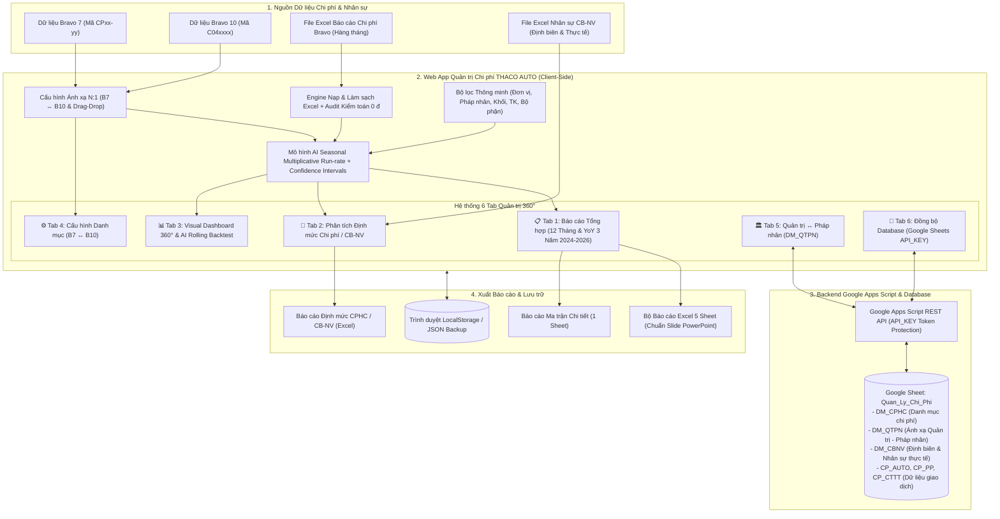

# HỆ THỐNG QUẢN TRỊ CHI PHÍ HÀNH CHÍNH - THACO AUTO
**Giải pháp Quản trị Chi phí Bravo 7 ↔ Bravo 10 | Phân tích Định mức CB-NV | So sánh Cùng kỳ YoY 3 Năm (2024-2026) | AI Forecast & Rolling Backtest | Đồng bộ 2 chiều Google Sheets (API_KEY)**

---

## 🌟 1. Giới thiệu Tổng quan & Giá trị Quản trị

Hệ thống Web App Quản trị Chi phí Hành chính được xây dựng và thiết kế chuyên biệt cho mô hình quản trị đa cấp, đa pháp nhân của **THACO AUTO** (từ Khối Văn phòng Điều hành, Khối Sản xuất Chu Lai, Khối Phân phối đến Hệ thống Công ty Tỉnh Thành / Showroom / Chi nhánh trên toàn quốc).



### 🎯 5 Giá trị Cốt lõi Hệ thống giải quyết triệt để:

1. **Chuẩn hóa & Đồng bộ 2 thế hệ ERP Bravo 7 ↔ Bravo 10:**
   - Tự động quy đổi và ánh xạ linh hoạt N:1 giữa các mã chi phí Bravo 7 (dạng `CP04-04`, `CP04-11`...) và Bravo 10 (dạng `C041801`, `C041501`...) thông qua thuật toán tách mảng phân tách dấu phẩy và so khớp chính xác từng phần tử (loại bỏ hoàn toàn lỗi substring giả dương).
   - Gom 39+ khoản mục chi phí chi tiết vào 5 nhóm chuẩn quản trị.

2. **So sánh Cùng kỳ (YoY) 3 Năm Liên tiếp (2026 vs 2025, 2026 vs 2024, 2025 vs 2024):**
   - Đánh giá xu hướng chi phí đa chu kỳ theo nguyên tắc Chuẩn hóa cùng quy mô quản trị (Like-for-like Scope).
   - Thiết lập **Ngưỡng cảnh báo biến động bất thường (mặc định ±20%)** trực tiếp trên thanh công cụ với các huy hiệu cảnh báo màu sắc trực quan (▲ Tăng đỏ ⚠️ / ▼ Giảm xanh).
   - Tích hợp Modal Drill-down chi tiết từng khoản mục và nhóm chi phí theo từng Pháp nhân / Đơn vị.

3. **Phân tích Hiệu quả Chi phí / CB-NV (Chỉ tiêu Định biên & Thực tế):**
   - Đo lường định mức chi phí hành chính bình quân trên mỗi nhân sự (Tr.đ / người / năm và Tr.đ / người / tháng) theo cả 2 chỉ số: **Nhân sự Thực tế** (phân tích hiệu quả vận hành thực tế) và **Định biên ngân sách** (quản trị hạn mức biên chế).
   - Hỗ trợ công tắc chuyển đổi linh hoạt: *Chỉ xem Thực tế*, *Chỉ xem Định biên*, hoặc *Song song cả 2 chỉ số*.
   - Hộp đối soát kiểm toán nhân sự (0-Person Audit Box) tự động cảnh báo nếu có đơn vị chưa có số liệu nhân sự.
   - Nạp file Excel nhân sự độc lập bằng cơ chế Kéo & Thả.

4. **Mô hình AI Dự báo Cuốn chiếu (Seasonal Multiplicative Run-rate) & Rolling Backtest:**
   - Kết hợp tốc độ tăng trưởng thực tế lũy kế năm 2026 (T1 đến T7) với trọng số mùa vụ chuẩn hóa lịch sử.
   - Tự động tính toán dải bao độ tin cậy (Confidence Interval: Max CI, Min CI) trên biểu đồ chuỗi thời gian 12 tháng.
   - Bảng Kiểm định Hồi quy Cuốn chiếu (Rolling Backtest Panel) tự động đo lường sai số phần trăm tuyệt đối trung bình (MAPE) và chỉ số tin cậy (Confidence Score) trên dữ liệu thực tế.

5. **Bảo mật API_KEY Token & Đồng bộ 2 Chiều Google Sheets:**
   - Xác thực bắt buộc bằng khóa bí mật `API_KEY` trong Script Properties của Google Apps Script, ngăn chặn truy cập trái phép.
   - Quản lý đồng bộ tập trung 3 bảng danh mục chuẩn: `DM_CPHC`, `DM_QTPN`, `DM_CBNV` và các bảng giao dịch `CP_AUTO`, `CP_PP`, `CP_CTTT`.

---

## 🖥️ 2. Hệ thống 6 Tab Quản trị 360° Độc lập

### 📋 Tab 1: Báo cáo Tổng hợp Chi phí (Report Matrix)
- **2 Dạng xem linh hoạt:**
  - **Dạng xem 12 Tháng:** Xem chi tiết tiến độ giải ngân từ Tháng 1 đến Tháng 12 (T1-T7 Thực tế, T8-T12 Kế hoạch / AI Dự phóng).
  - **Dạng xem YoY 3 Năm:** So sánh song song số liệu 2024, 2025, 2026 và 3 cặp tỷ lệ tăng/giảm cùng kỳ: **2026 vs 2025**, **2026 vs 2024**, **2025 vs 2024**.
- **Cảnh báo Biến động Bất thường:** Ô điều chỉnh nhanh ngưỡng cảnh báo (mặc định ±20%) giúp nhận diện ngay các khoản mục vượt ngân sách.
- **Bộ lọc Trọng yếu (⭐):** Chuyển đổi giữa xem tất cả khoản mục hoặc chỉ xem 10 khoản mục trọng yếu chiếm 80% ngân sách.
- **Tính năng mở rộng:** Cố định 4 cột đầu (Sticky Columns), thu gọn/mở rộng nhóm (`+`/`−`), nút Drill-down đơn vị.

### 👥 Tab 2: Phân tích Định mức Chi phí / CB-NV (Vị trí thứ 2 sau Báo cáo)
- **Thanh công cụ Chế độ Hiển thị:**
  - `Thực tế`: Xem theo nhân sự thực tế hiện có tại đơn vị.
  - `Định biên`: Xem theo hạn mức biên chế phê duyệt.
  - `⚡ Song song cả 2`: Hiển thị đầy đủ cả Định biên, Thực tế và % Lấp đầy định biên.
- **Dải thẻ Executive KPI Cards:**
  - Tổng nhân sự toàn hệ thống (Thực tế, Định biên, Tỷ lệ lấp đầy).
  - CPHC / CB-NV Thực tế 2026 (Tr.đ / người / năm & Tr.đ / người / tháng).
  - CPHC / Định biên 2026 (Tr.đ / người / năm & Tr.đ / người / tháng).
  - Biến động Định mức YoY (So sánh cùng kỳ 2026 vs 2025: % chênh lệch & số tiền tuyệt đối).
- **Hộp Đối Soát Kiểm Toán (0-Person Audit Box):** Tự động rà soát toàn bộ các pháp nhân đang hoạt động. Cảnh báo màu đỏ nổi bật nếu phát hiện đơn vị có nhân sự = 0 hoặc chưa nạp dữ liệu; hiển thị huy hiệu xanh "100% Khớp Audit" khi toàn hệ thống đã đủ dữ liệu.
- **2 Biểu đồ Phân tích Chuyên sâu:**
  - 📊 **Biểu đồ Benchmark Chi phí/Người:** So sánh định mức từng đơn vị với đường chuẩn bình quân toàn hệ thống (System Benchmark Line).
  - 🎯 **Biểu đồ Tương quan Tuyến tính (Scatter Plot):** Tương quan giữa Quy mô nhân sự (Người) và Tổng chi phí hành chính (Tr.đ).
- **Bảng Ma trận Chi phí / CB-NV theo Pháp nhân:** Chi tiết từng đơn vị, hỗ trợ tìm kiếm nhanh, xuất Excel độc lập.
- **Bộ Kéo Thả Nạp File Excel Nhân Sự:** Hỗ trợ nạp file danh mục nhân sự, xem trước dữ liệu và tải file mẫu chuẩn.

### 📊 Tab 3: Visual Dashboard 360° & AI Rolling Backtest
- **Bảng Kiểm định Mô hình AI (Rolling Backtest Panel):**
  - Đánh giá độ chính xác của thuật toán Run-rate Mùa vụ trên các tháng thực tế.
  - Hiển thị chỉ số sai số **MAPE (%)** và **Điểm tin cậy (Confidence Score)** đạt chuẩn phân tích tài chính.
- **Biểu đồ Diễn biến 12 Tháng kèm Dải tin cậy mùa vụ (Confidence Intervals):**
  - Đường chi phí thực tế T1-T7 và dự báo T8-T12.
  - 2 đường nét đứt Max CI và Min CI thể hiện biên độ dao động dự kiến.
- **Hệ thống Biểu đồ Phân tích Đa chiều:** Cơ cấu chi phí theo 4 Khối, Top khoản mục trọng yếu, So sánh cùng kỳ Like-for-like, Cơ cấu chi phí theo Khối phòng ban, Top 10 Bộ phận chi phí lớn nhất.

### ⚙️ Tab 4: Cấu hình Danh mục (B7 ↔ B10 & Drag-and-Drop)
- **Ánh xạ linh hoạt N:1:** Cho phép ghép nhiều mã Bravo 7 vào 1 mã Bravo 10 chuẩn.
- **Kéo & Thả chuyển nhóm (`⠿ Drag`):** Thao tác kéo thả trực quan để phân loại lại khoản mục vào các nhóm chi phí.
- **Thư viện Icon Nhóm:** Chọn icon đại diện cho từng nhóm chi phí từ bảng mã icon doanh nghiệp.

### 🏛️ Tab 5: Quản trị ↔ Pháp nhân (DM_QTPN)
- **Cấu trúc Dòng Mẹ (Quản trị) - Dòng Con (Pháp nhân):**
  - Quản lý quan hệ trực thuộc giữa Đơn vị Quản trị và các Chi nhánh / Showroom / Pháp nhân.
  - Thao tác kéo thả để điều chuyển pháp nhân giữa các đơn vị quản trị.
- **Làm sạch Slicer an toàn:** Chỉ ẩn các pháp nhân ngừng hoạt động khỏi bộ lọc Slicer, **tuyệt đối không xóa dữ liệu chi phí lịch sử** của pháp nhân đó để bảo toàn số liệu so sánh cùng kỳ.

### 🔄 Tab 6: Đồng bộ Database (Google Sheets API_KEY)
- **Bảo mật Token API_KEY:** Kết nối an toàn với Google Apps Script Web App.
- **Đồng bộ 2 chiều toàn diện:** Tải/Đẩy dữ liệu danh mục `DM_CPHC`, `DM_QTPN`, `DM_CBNV` và dữ liệu thực tế `CP_AUTO`, `CP_PP`, `CP_CTTT`.
- **Kiểm tra kết nối (Test Key):** Xác thực trạng thái kết nối và phản hồi mã khóa API trước khi đồng bộ.

---

## 📥 3. Trình Nạp Dữ Liệu Excel Bravo & Kiểm Toán 0 Đồng

1. **Thao tác Nạp Đơn giản:**
   - Nhấp nút **"Nạp data chi phí"** trên thanh tiêu đề.
   - Kéo thả file Excel xuất từ phần mềm Bravo (ví dụ: `CPHC - THACO AUTO 2025.xlsx`, `CPHC - THACO AUTO T1 Den T7 nam 2026.xlsx`...).
2. **Quy tắc Đơn vị Tiền tệ:**
   - Hệ thống lưu trữ nội bộ toàn bộ dữ liệu ở giá trị tiền tệ nguyên bản (**VNĐ**).
   - Chỉ quy đổi sang **Triệu VNĐ** (`/ 1,000,000`) tại tầng hiển thị giao diện và xuất báo cáo, đảm bảo không xảy ra hiện tượng lệch số liệu bội số 1 triệu lần.
3. **Bảng Đối Chiếu Kiểm Toán Dữ Liệu:**
   - So sánh tổng cộng các dòng chi phí đã làm sạch với dòng *"CỘNG CHI PHÍ HÀNH CHÁNH"* của file gốc Bravo.
   - Hiển thị thông báo kiểm toán: **"Khớp 100% từng đồng (0 đ)"**.

---

## 📤 4. Hệ Thống Xuất Báo Cáo Đa Định Dạng

| Định dạng Báo cáo | Nút chức năng | Nội dung kết xuất |
| :--- | :--- | :--- |
| **Báo cáo Excel 5 Sheet (Chuẩn PowerPoint)** | `Xuất báo cáo` > Option 1 | Bộ báo cáo phục vụ họp Thường trực / HĐQT (Tổng quan Quý, Chi tiết Tháng & Khối, 30 Khoản mục, 111 Pháp nhân, Tỷ lệ CPHC/Doanh thu) |
| **Báo cáo Ma trận Chi tiết (1 Sheet)** | `Xuất báo cáo` > Option 2 | Xuất toàn bộ bảng ma trận theo đúng bộ lọc và chế độ xem hiện hành |
| **Báo cáo Định mức CPHC / CB-NV** | Tab 2 > `Xuất Excel` | Bảng ma trận định mức chi phí trên nhân sự (Định biên, Thực tế, CPHC/người, So sánh 2025, YoY) |
| **File Excel Mẫu Nhập Nhân Sự** | Tab 2 > `Tải file Excel mẫu` | File template chuẩn `DM_CBNV` có sẵn danh sách các đơn vị trong hệ thống để nhập số liệu nhân sự |

---

## 🔗 5. Hướng Dẫn Tích Hợp Vào Menu Sidebar QTVP-ASDS

Hệ thống Quản lý Chi phí Hành chính (`qlcphc`) được thiết kế để hoạt động hoàn toàn độc lập, đồng thời hỗ trợ nhúng trực tiếp dạng Iframe vào thanh Menu Sidebar của hệ thống tổng thể **QTVP-ASĐS (Quản trị Văn phòng - An toàn Sức khỏe Đời sống)**.

### Cách cấu hình nhúng Iframe:

Trong giao diện Sidebar của dự án `QTVP-ASDS`, thêm một mục menu mới dẫn tới ứng dụng Chi phí:

```html
<!-- Ví dụ cấu hình Menu Item trong Sidebar QTVP-ASDS -->
<a href="#cphc" onclick="loadCphcModule()" class="sidebar-menu-item flex items-center gap-3 px-4 py-3 text-slate-700 hover:bg-blue-50 rounded-xl font-bold">
    <span class="text-lg">💰</span>
    <span>Quản trị Chi phí Hành chính</span>
    <span class="text-[10px] bg-blue-100 text-[#00529C] px-2 py-0.5 rounded-full font-extrabold">B7 ↔ B10</span>
</a>

<!-- Container hiển thị Iframe trong Main Area của QTVP-ASDS -->
<div id="cphc-iframe-container" class="hidden w-full h-full">
    <iframe id="cphc-iframe" src="../CHI PHI/index.html" class="w-full h-full border-0" frameborder="0"></iframe>
</div>

<script>
function loadCphcModule() {
    // Ẩn các section khác và hiển thị iframe container của CPHC
    document.querySelectorAll('.main-section').forEach(el => el.classList.add('hidden'));
    const container = document.getElementById('cphc-iframe-container');
    if (container) container.classList.remove('hidden');
}
</script>
```

---

## ⚙️ 6. Cấu hình Google Apps Script (`google_apps_script.js`)

Mã nguồn `google_apps_script.js` được cài đặt trên file Google Sheet [Quan_Ly_Chi_Phi](https://docs.google.com/spreadsheets/d/1UwV3TbvAfeLZslEazzcFWi5cXsJo98AQmxX5dXH1Pqo/edit) (ID: `1UwV3TbvAfeLZslEazzcFWi5cXsJo98AQmxX5dXH1Pqo`).

### Các Sheet quản lý:
1. **`DM_CPHC`:** Cấu hình danh mục khoản mục chi phí, mã B7, mã B10, Nhóm phí, Trọng yếu (⭐).
2. **`DM_QTPN`:** Cấu hình ma trận ánh xạ Quản trị ↔ Pháp nhân.
3. **`DM_CBNV`:** Danh mục Định biên và Nhân sự Thực tế các đơn vị theo năm.
4. **`CP_AUTO`:** Dữ liệu chi phí THACO AUTO (C1101 - VPĐH).
5. **`CP_PP`:** Dữ liệu chi phí Phân Phối THACO AUTO (C2305).
6. **`CP_CTTT`:** Dữ liệu chi phí các Công ty Tỉnh Thành / Chi nhánh.

### Cấu hình Khóa Bảo Mật API_KEY:
- Khóa mặc định: `THACO_CPHC_2026_SECURE_TOKEN`.
- Để thay đổi khóa, trong Apps Script mở **Project Settings (Cài đặt dự án)** > **Script Properties (Thuộc tính tập lệnh)** > Thêm thuộc tính `API_KEY` với giá trị mong muốn.
- Nhập cùng giá trị `API_KEY` này vào giao diện Cài đặt kết nối trên Web App để xác thực quyền truy cập.

---

## 🧪 7. Kiểm Thử Tự Động & Đối Soát Kiểm Toán (Automated Verification)

Dự án trang bị bộ 3 kịch bản kiểm thử tự động xác minh toàn diện các yêu cầu kỹ thuật:

```bash
# 1. Kiểm thử Điểm A (Bảo toàn tiền tệ VNĐ & Đối chiếu dòng CỘNG Bravo 0 đ):
node tests/test_evidence_point_a.js

# 2. Kiểm thử Bảo mật API_KEY (Chặn 401 khi thiếu/sai key, pass 200 khi đúng key):
node tests/test_evidence_api_key.js

# 3. Kiểm thử Audit Box CB-NV (Khớp 0 người, cảnh báo vàng khi thiếu dòng CỘNG, báo đỏ khi lệch):
node tests/test_evidence_cbnv_audit.js
```

---

## 🚀 8. Hướng dẫn Khởi chạy Nhanh

### Chạy trực tiếp trên máy tính (Offline / Local):
1. Mở thư mục dự án: `i:\My Drive\Web app\CHI PHI\`
2. Nhấp đúp chuột vào file `index.html` hoặc chạy file `Chay_Ung_Dung.bat` để khởi động máy chủ cục bộ.
3. Ứng dụng chạy mượt mà trên Google Chrome, Microsoft Edge hoặc Cốc Cốc mà không phụ thuộc vào internet.

---
*Phát triển chuyên biệt cho Hệ thống Quản trị THACO AUTO.*

